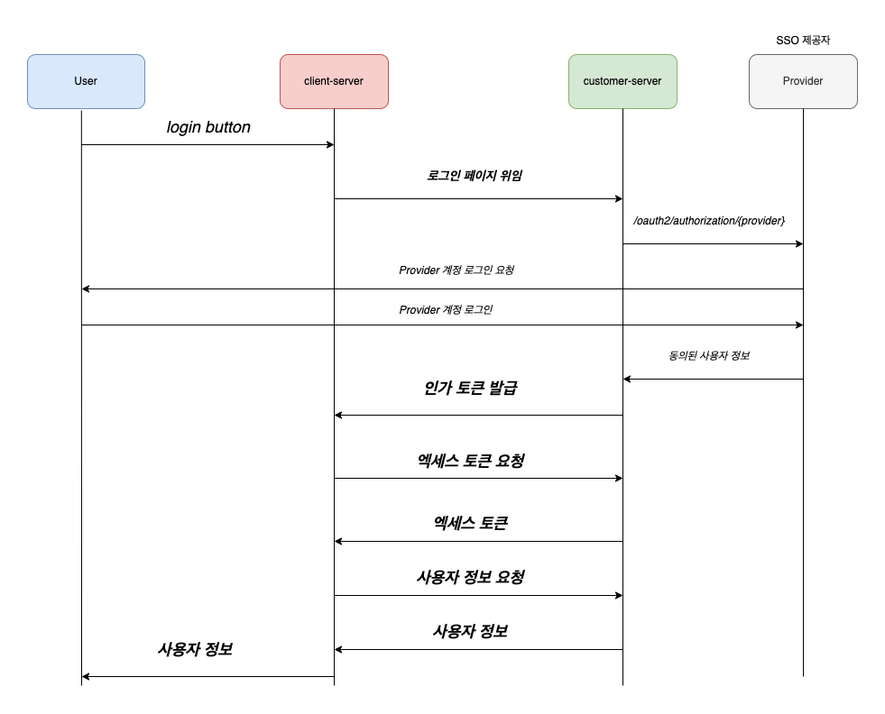

# customer-server

---

Single Sign-On (SSO) 은 분명히 사용자와 개발자에게 편리함을 가져다준다. \
하지만 SSO만으로는 특화된 비즈니스를 만족시킬 수 없기에 사용자 관리 데이터베이스를 설계하고 구축한다. \
사용자 경험은 개선했지만 비즈니스가 여러 개라면 비즈니스마다 데이터베이스를 설계하고 구축해야 한다.\
SSO를 이용하면서 사용자 정보 또한 한곳에서 관리하는 서버를 구축해보자.

## 요구사항 분석

---

- customer-server 를 사용하기위해서는 먼저 client 등록을 한다. client 등록시 redirect-url 을 설정해야하며
  등록된 client 를 관리한다.

- customer-server 에 로그인을 위임하기위해서는 /auth/login 앤드포인트에 클라이언트 정보와 함깨 요청한다.

- customer-server 는 로그인 페이지와 kakao , naver , google 로그인과 자체 회원가입 , 로그인 기능도 제공한다.

- customer-server 는 로그인에 성공한 유저에대해 코드를 발급해주며 이는 엑세스 토큰을 얻기위해 사용된다.(코드의 유효시간을 짧게 유지한다.)

- customer-server 는 코드를 검증하고 엑세스 토큰을 발급해준다.

- customer-server 는 엑세스 토큰을 검증하고 사용자 정보를 응답한다.

## Feature List

----

### 로그인

- google , kakao , naver 로그인을 지원하면서 keycloak 을 활용한 customer-server 로그인 기능도 지원한다.
- 로그인 기능을 사용하고자한다면 먼저 클라이언트를 customer-server 에 등록하고 /auth/login 으로 로그인 요청을 한다.

  ```
  GET /auth/login
  HOST <Comming Soon>
  ```
    * 사전 조건 : client 등록
    * Response : 로그인 페이지를 응답

### 회원가입

- keycloak을 활용한 회원 가입 기능 지원
- 회원가입 기능을 사용하고자한다면 클라이언트를 customer-server 에 등록하고 /auth/signup 으로 회원가입을 요청한다
  ```
  GET /signup
  HOST <Comming Soon>
  ```
    * 사전 조건 : client 등록
    * Response : 회원가입 페이지를 응답

### 코드 발급

- 로그인 성공 시 엑세스 토큰을 발급 받을 수 있는 코드를 리다이렉트할때 전달한다.

  ```
  GET /auth/code
  HOST <Comming Soon>
  ```
    * 사전 조건 : 로그인
    * Response : redirectUrl?code=${CODE}

### 엑세스 토큰

- 사용자 정보를 조회할 수 있는 엑세스 토큰 발급하고 검증한다.

  ```
  POST /auth/gettoken
  HOST <Comming Soon>
  Authorization: Bearer ${CODE}
  ```
    * 사전 조건 : 코드 발급
    * Response

      | Name | Type   | Description |
          |--------|-------------|------------------------------|
      | accessToken    | String | 엑세스 토큰      |

### 사용자 정보

- 엑세스 토큰으로 사용자 정보를 가져올 수 있다.

  ```
  POST /api/v1/customer
  HOST <Comming Soon>
  Authorization: Bearer ${ACCESS_TOKEN}
    ```
    * 사전 조건 : 엑세스 토큰 발급
    * Response

      | Name             | Type    | Description     |
          |------------------|-----------------|------------------------------|
      | id               | Long    | 고유 식별 번호        |
      | username         | String  | username        |
      | nickname         | String  | 닉네임             |
      | email            | String  | 사용자 이메일         |
      | providerType     | String  | keycloak,kakao,naver,google | 
      | roleType         | String  | ADMIN,USER      | 
      | blogUrl          | String  | 사용자 블로그         |
      | profileImageUrl  | String  | 사용자 프로필         |
      | introduceComment | String  | 사용자 소개          |

### Client 등록

- 등록된 Client만 앤드포인트를 이용할 수 있다.
- Client 등록 기능과 Redirect 설정 기능을 제공한다.

  ```
  POST /client/register
  HOST <Comming Soon>
  ```
    * 사전 조건 : 없음
    * Response : 없음

## Customer Server Process

---


1. client-server 는 customer-server 에 로그인을 위임한다
2. customer-server 는 로그인에 성공한 사용자에 대해 코드를 발급하고 응답한다.
3. client-server 는 코드로 customer-server 로부터 엑세스 토큰을 발급받는다.
4. 발급 받은 엑세스 토큰으로 client-server 는 customer-server 로부터 사용자 정보를 가져온다.

---

## Tech Stack

* Spring Boot 2.7.7
* Spring Security
* Java 17
* Spring Web
* Spring Data JPA
* Thymeleaf
* Spring Security
* MySQL Driver
* JJWT

---

## 문제 해결

| Error Code Name | Description                       | Solution                          |
|-----------------|-----------------------------------|-----------------------------------|
| C001            | 유효하지 않은 클라이언트 ID인 경우              | 클라이언트를 등록하여 ID를 발급 받아야합니다.        |
| C002            | 사용자 정보 요청에 엑세스 토큰을 누락한 경우         | 사용자 정보 요청에는 엑세스 토큰을 헤더에 담아서 요청합니다 |
| C003            | 유효하지 않은 엑세스 토큰을 으로 사용자 정보를 요청한 경우 | 클라이언트를 등록하여 ID를 발급 받아야합니다.        |
| C004            | 인증되지 않은 상태에서 코드 발급을 요청한 경우        | 로그인을 진행합니다.                       |
| C005            | 유효하지 않은 코드로  엑세스 토큰을 요청한 경우       | 로그인을 진행 한 후에 유효한 코드를 발급받습니다.      |


